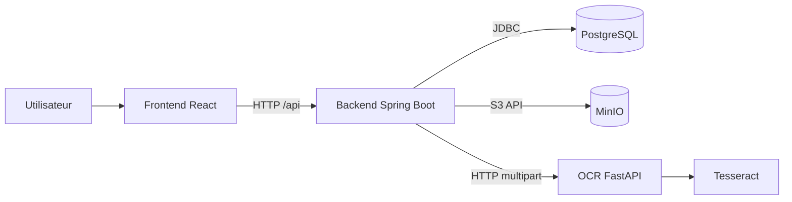

# Facturation Electronique

Application MVP de facturation electronique composee d'un frontend React, d'un backend Spring Boot, d'une base PostgreSQL, d'un stockage S3 compatible MinIO et d'un service OCR FastAPI avec Tesseract.

## Stack

| Brique | Technologie |
| --- | --- |
| Frontend | React, TypeScript, Vite |
| Backend | Java 25, Spring Boot |
| Database | PostgreSQL |
| Stockage fichiers | MinIO, API S3 |
| OCR | FastAPI, Tesseract |
| Reverse proxy | Traefik global (staging/prod), Nginx pour les fichiers React |
| Orchestration locale | Docker Compose |
| Agent de developpement | Node.js, React, Codex CLI, Jira |

## Architecture Rapide



Documentation detaillee:

- [Architecture complete](docs/architecture.md)
- [Environnements Docker](docs/docker-environments.md)
- [Domaines et proxy Traefik du VPS](docs/vps-traefik.md)
- [Backend et configuration Spring](docs/backend.md)
- [Service OCR](docs/ocr.md)
- [Stockage et base de donnees](docs/storage-and-database.md)
- [Exploitation et commandes utiles](docs/operations.md)
- [Agent Jira, Git et Codex](tools/kan-agent/README.md)

## Prerequis

- Docker
- Docker Compose v2
- Make, optionnel mais recommande

Java, Maven, Node et Python ne sont pas necessaires sur la machine hote pour lancer le projet via Docker.

## Demarrage Local

```bash
make dev
```

Ou sans Make:

```bash
docker compose --env-file env/.env.dev \
  -f docker-compose.yml \
  -f docker-compose.dev.yml \
  up --build
```

Services disponibles en developpement:

| Service | URL |
| --- | --- |
| Frontend | http://localhost:5173 |
| Backend | http://localhost:8080 |
| Documentation API (Swagger UI) | http://localhost:8080/swagger-ui.html |
| Contrat OpenAPI JSON | http://localhost:8080/v3/api-docs |
| OCR | http://localhost:8000 |
| MinIO API | http://localhost:9000 |
| MinIO Console | http://localhost:9001 |
| PostgreSQL | localhost:5432 |

Identifiants MinIO par defaut en dev:

```text
User: minioadmin
Password: minioadmin
Bucket: invoice-files
```

## Commandes Principales

```bash
make dev
make dev-down
make staging
make staging-down
make prod
make prod-down
make logs
make ps
make agent-init
make agent
make agent-down
```

## Environnements

Les variables sont regroupees dans:

```text
env/.env.dev
env/.env.staging.example
env/.env.prod.example
```

Pour le staging ou la production:

```bash
cp env/.env.staging.example env/.env.staging
cp env/.env.prod.example env/.env.prod
```

Puis remplacer toutes les valeurs `change-me` et verifier les domaines.
Configurer le reseau externe `proxy` et le routage du VPS en suivant
[la procedure Traefik](docs/vps-traefik.md) avant de lancer l'environnement concerne:

```bash
make staging
make prod
```

## Tests Et Verification

Verifier les fichiers Compose:

```bash
docker compose --env-file env/.env.dev \
  -f docker-compose.yml \
  -f docker-compose.dev.yml \
  config --quiet
```

Tester le backend dans Docker avec H2 et les services mock/local:

```bash
docker compose --env-file env/.env.dev \
  -f docker-compose.yml \
  -f docker-compose.dev.yml \
  run --rm --no-deps \
  -e SPRING_PROFILES_ACTIVE= \
  backend \
  mvn test \
  -Dspring.datasource.url=jdbc:h2:mem:facturation \
  -Dspring.datasource.driver-class-name=org.h2.Driver \
  -Dspring.datasource.username=sa \
  -Dspring.datasource.password= \
  -Dspring.jpa.hibernate.ddl-auto=create-drop \
  -Dapp.ocr.mock=true \
  -Dapp.storage.type=local
```

## Notes MVP

- Les profils Docker utilisent `spring.jpa.hibernate.ddl-auto=update` pour accelerer le developpement MVP.
- Avant un usage production reel, remplacer `ddl-auto=update` par des migrations versionnees, par exemple Flyway ou Liquibase.
- Les secrets de staging/prod ne doivent pas rester dans Git avec des valeurs reelles.
