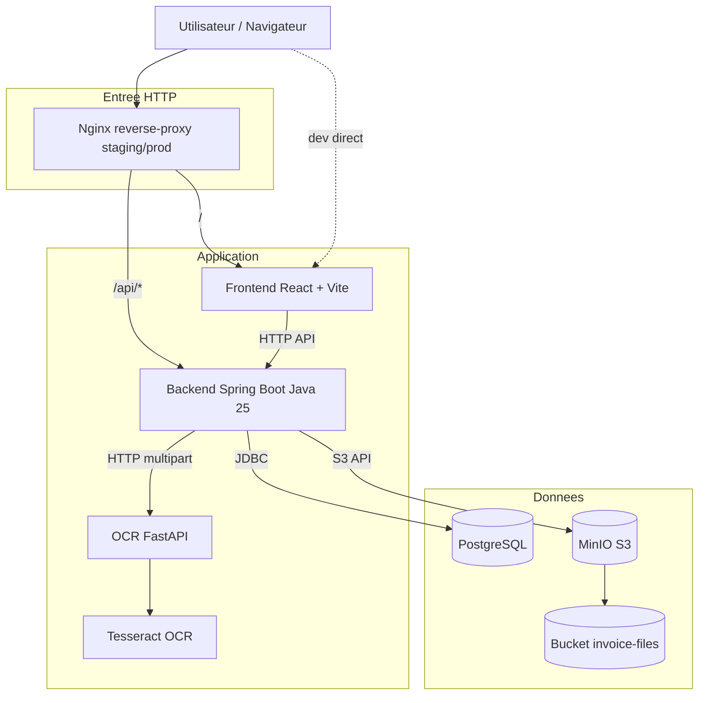
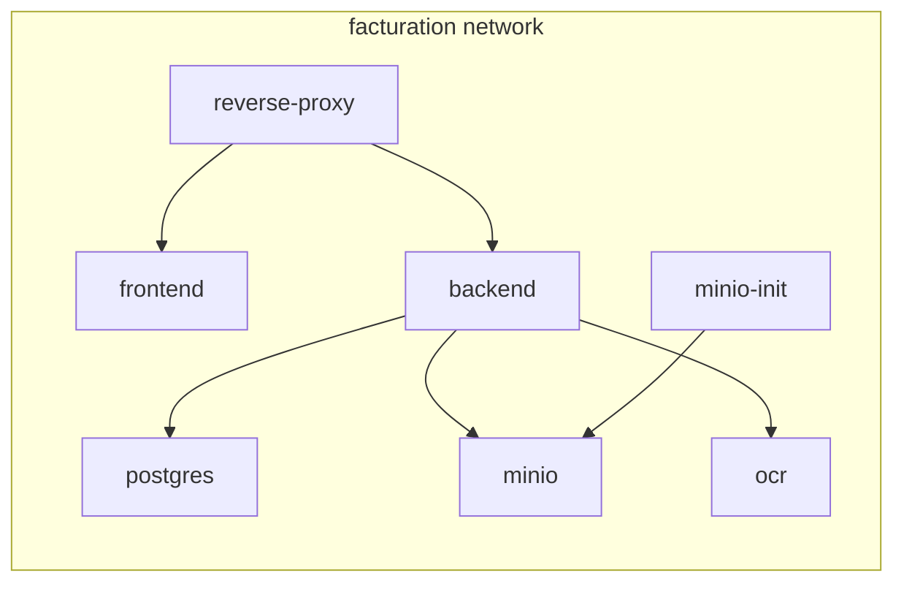
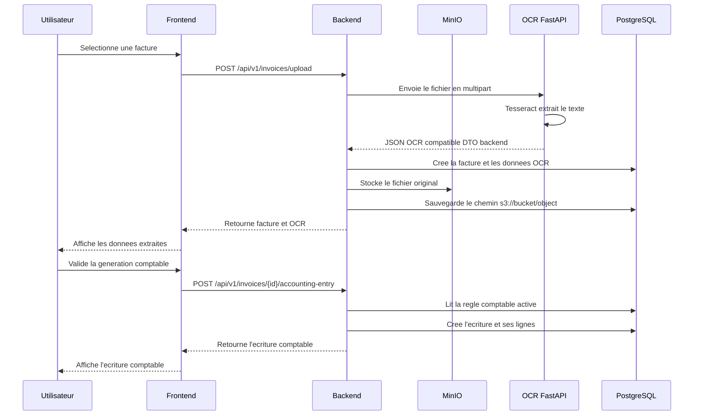
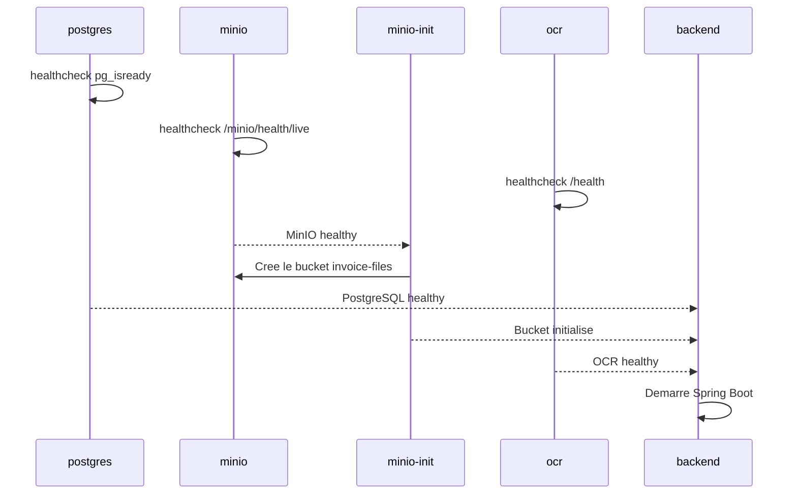

# Architecture Complete

Ce document decrit l'architecture applicative et l'infrastructure Docker actuellement mise en place pour le MVP.

## Vue D'ensemble



En developpement, les ports des services sont exposes directement. En staging et prod, l'entree recommandee est le reverse proxy Nginx.

## Services

| Service Compose | Role | Image / Build |
| --- | --- | --- |
| `frontend` | Interface React | `frontend/Dockerfile` ou `frontend/Dockerfile.dev` |
| `backend` | API metier Spring Boot | `backend/Dockerfile` ou `backend/Dockerfile.dev` |
| `postgres` | Base relationnelle | `postgres:17-alpine` |
| `minio` | Stockage objet S3-compatible | `minio/minio:latest` |
| `minio-init` | Creation du bucket | `minio/mc:latest` |
| `ocr` | Extraction OCR | `ocr/Dockerfile` ou `ocr/Dockerfile.dev` |
| `reverse-proxy` | Routage HTTP staging/prod | `nginx:1.27-alpine` |

## Reseau Docker



Les services utilisent les noms DNS internes Docker:

```text
postgres:5432
minio:9000
ocr:8000
backend:8080
frontend:80
```

## Flux Upload De Facture



## Flux De Demarrage Docker



## Routage HTTP

En staging/prod, `docker/nginx/reverse-proxy.conf` route:

| Route | Destination |
| --- | --- |
| `/` | `frontend:80` |
| `/api/*` | `backend:8080` |

Le frontend de production est servi par Nginx depuis les fichiers statiques generes par Vite.

## Profils Spring

| Profil | Usage | Database | OCR | Stockage |
| --- | --- | --- | --- | --- |
| default | Tests/local hors Docker | H2 | Mock | Local temp |
| dev | Docker dev | PostgreSQL | FastAPI | MinIO |
| staging | Preproduction | PostgreSQL | FastAPI | MinIO |
| prod | Production | PostgreSQL | FastAPI | MinIO |

## Points A Surveiller

- `ddl-auto=update` est acceptable pour le MVP, mais pas pour une production durable.
- Les secrets prod doivent etre fournis via `.env.prod` non versionne.
- Le service OCR actuel fournit une extraction heuristique simple. Il faudra l'enrichir avec une vraie logique de parsing facture.
- Le stockage MinIO est local au compose. Pour une production externe, remplacer l'endpoint S3 et les credentials.
