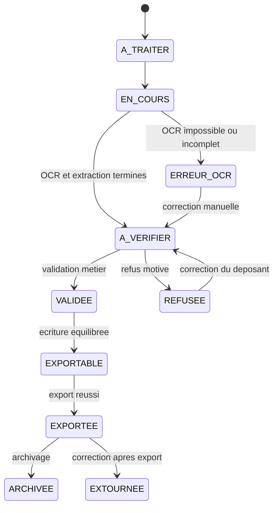

# Workflows Metier Backend

Ce document constitue la reference fonctionnelle pour les futurs tickets backend.
Il decrit la cible metier issue des huit diagrammes de workflow fournis au projet.

La correspondance image par image et la provenance des exigences sont decrites
dans `context-sources.md`. Les besoins consolides et les decisions validees sont
respectivement dans `product-requirements.md` et `project-decisions.md`.

Il ne decrit pas uniquement le code deja implemente. Chaque ticket devra donc
preciser s'il complete une capacite existante ou s'il introduit une nouvelle
capacite.

## Perimetre

La priorite actuelle est de stabiliser les besoins metier avant de traiter en
detail l'authentification, les autorisations, la facturation SaaS et les autres
sujets d'infrastructure.

Le coeur fonctionnel comprend:

- la gestion des factures fournisseurs;
- la gestion des factures clients;
- l'extraction et la correction des donnees;
- la generation et la validation des ecritures comptables;
- la recherche et la gestion documentaire;
- les exports comptables;
- la configuration metier de l'organisation;
- la gestion des erreurs et des cas limites.

## Vocabulaire

| Terme | Definition |
| --- | --- |
| Deposant | Utilisateur ou canal ayant transmis un document |
| Validateur | Utilisateur charge de valider ou refuser une facture |
| Facture fournisseur | Facture recue par l'organisation pour un achat |
| Facture client | Facture emise par l'organisation pour une vente |
| Donnees extraites | Champs identifies automatiquement a partir du document |
| Ecriture comptable | Ensemble equilibre de mouvements comptables associe a une facture |
| Ligne comptable | Mouvement au debit ou au credit sur un compte comptable |
| GED | Gestion electronique des documents |
| Exportable | Facture validee et comptablement correcte, prete a etre exportee |
| Extourne | Document ou ecriture annule comptablement par une nouvelle ecriture inverse |

## Etat Actuel Du Backend

Le backend implemente deja une premiere tranche du workflow fournisseur:

- upload manuel d'un PDF ou d'une image;
- stockage du fichier en local ou dans MinIO;
- analyse OCR par FastAPI et Tesseract;
- extraction de plusieurs champs de facture;
- creation ou rattachement d'un fournisseur;
- correction des principales donnees extraites;
- validation ou rejet simple d'une facture;
- generation d'une ecriture comptable selon une regle configuree;
- consultation d'une facture et recherche simple.

Les autres etapes decrites ci-dessous representent la cible fonctionnelle. Elles
doivent etre implementees progressivement, avec des changements limites et des
responsabilites clairement separees.

## Workflow 1 - Entree Dans Le Produit Et Vue D'ensemble

### Nouvel utilisateur

1. L'utilisateur cree son compte.
2. Il cree une organisation ou accepte une invitation.
3. Il choisit un plan SaaS.
4. Il effectue la configuration initiale de l'organisation.
5. Il accede au dashboard principal.

### Utilisateur existant

1. L'utilisateur se connecte.
2. Il selectionne l'organisation sur laquelle il souhaite travailler.
3. Il accede au dashboard principal.

### Onboarding de l'organisation

La configuration initiale comprend:

- les informations legales: nom, raison sociale, SIRET, numero de TVA et adresse;
- l'import ou la creation du plan comptable;
- la configuration des fournisseurs, clients, chantiers, dossiers et classeurs;
- la configuration des roles et permissions;
- la configuration du workflow de validation;
- la configuration des exports CSV, FEC ou propres a un logiciel comptable.

### Dashboard cible

Le dashboard doit fournir au minimum:

- les factures a traiter;
- les factures a verifier;
- les factures en attente de validation;
- les factures exportables;
- les alertes de doublon, d'OCR faible ou d'ecriture desequilibree;
- les indicateurs de volume, montant, TVA et repartition par statut.

Il donne acces aux principaux modules: factures fournisseurs, factures clients,
recherche documentaire, export comptable, administration et abonnement.

## Workflow 2 - Facture Fournisseur

### 1. Reception du document

Les canaux cibles sont:

- upload manuel d'un PDF ou d'une image;
- depot Word si ce format est retenu ulterieurement;
- reception par une adresse email dediee;
- reception automatique par API ou webhook d'une plateforme agreee;
- scan mobile dans une phase future.

Le MVP peut conserver l'upload manuel comme seul canal actif. Tous les canaux
doivent cependant converger vers le meme traitement metier.

### 2. Creation et classification

1. Le document est stocke avant le lancement des traitements automatiques.
2. Une fiche document est creee avec le statut `A_TRAITER`.
3. Le backend determine le type de document.
4. Le backend verifie que le document est lisible et supporte.
5. Un document illisible passe en erreur et reste disponible pour correction.

Une erreur OCR ne doit pas provoquer la perte du fichier original.

### 3. OCR et extraction

Le document lisible est pretraite puis transmis a l'OCR. Les champs attendus
comprennent au minimum:

- nom du fournisseur;
- SIRET et numero de TVA du fournisseur;
- numero de facture;
- date de facture;
- date d'echeance;
- reference de commande;
- montant HT;
- montant de TVA;
- montant TTC;
- IBAN ou informations de paiement lorsqu'ils sont disponibles;
- texte OCR brut;
- score de confiance global et, si possible, score par champ.

Les champs absents ou incertains doivent rester identifiables comme tels. Le
backend ne doit pas inventer une valeur metier.

### 4. Detection des doublons

Apres extraction, le backend recherche des factures similaires dans la meme
organisation. La comparaison utilise notamment:

- le fournisseur;
- le numero de facture;
- la date;
- le montant TTC.

Si un doublon probable est detecte, le traitement est suspendu et l'utilisateur
peut:

- confirmer puis fusionner les documents;
- ignorer l'alerte et poursuivre;
- supprimer ou rejeter le nouveau document.

La decision doit etre historisee.

### 5. Correction et classement

L'utilisateur consulte les donnees extraites et peut les corriger. Le backend
doit conserver la valeur initiale, la valeur corrigee, l'auteur et la date de la
correction.

La facture peut ensuite etre:

- rattachee au bon fournisseur;
- classee dans un dossier, classeur ou chantier;
- rattachee a une dimension analytique si cette fonction est activee.

### 6. Proposition d'ecriture comptable

La proposition comptable est construite a partir:

- des montants valides de la facture;
- du fournisseur identifie;
- du plan comptable de l'organisation;
- des regles comptables configurees par l'organisation;
- de la nature de la depense lorsqu'elle est disponible.

Une facture fournisseur simple produit generalement:

- une ou plusieurs lignes de charges au debit;
- une ligne de TVA deductible au debit si la TVA est applicable;
- une ligne de dette fournisseur au credit.

Le nombre de lignes ne doit pas etre impose par le service de facture. Il depend
des regles comptables et, a terme, du detail des lignes de facture.

Le backend verifie que la somme des debits est egale a la somme des credits. Une
ecriture desequilibree ne peut pas devenir exportable.

### 7. Validation metier

Selon la configuration de l'organisation:

- la facture peut etre validee directement;
- elle peut etre assignee a un validateur;
- le validateur peut valider, refuser ou demander une correction;
- un refus doit contenir un motif;
- le deposant doit pouvoir consulter la decision et corriger la facture.

La facture validee et son ecriture equilibree deviennent exportables.

### 8. Paiement, export et archivage

Le suivi du paiement peut marquer la facture comme payee. Il ne remplace pas le
statut comptable ou documentaire.

Une facture exportable peut etre integree dans un lot CSV ou FEC. Apres un export
reussi:

- un numero de piece est attribue;
- la facture est marquee comme exportee;
- l'operation est historisee;
- le document et ses donnees peuvent etre archives;
- une facture archivee devient consultable en lecture seule.

## Workflow 3 - Facture Client

Une facture client peut etre creee depuis un formulaire, importee ou dupliquee a
partir d'une facture existante.

### Creation manuelle

1. Selectionner le client.
2. Ajouter les lignes de facturation.
3. Renseigner quantites, prix, remises et taux de TVA.
4. Calculer les montants HT, TVA et TTC.
5. Renseigner l'echeance, les conditions de paiement et les mentions legales.
6. Previsualiser la facture.
7. Controler les champs obligatoires.
8. Generer le PDF et, si active, la version Factur-X.

### Import

1. Importer un PDF, une image ou un fichier structure.
2. Lire les donnees par OCR ou depuis le format structure.
3. Premplir les champs.
4. Permettre une correction manuelle.
5. Effectuer les memes controles que pour une creation manuelle.

### Duplication

La duplication reprend le client, les lignes et les parametres pertinents. Les
dates, numeros et montants restent modifiables avant validation.

### Comptabilisation client

L'ecriture comptable client comprend generalement:

- le compte client au debit pour le TTC;
- un ou plusieurs comptes de produits au credit pour le HT;
- le compte de TVA collectee au credit si la TVA est applicable.

L'ecriture doit etre equilibree avant emission.

### Emission et suivi

Les canaux cibles sont le telechargement, l'email, l'impression et une plateforme
agreee. Apres emission, la facture est suivie jusqu'au paiement. Une facture
payee peut ensuite etre exportee et archivee.

Le modele de donnees devra distinguer explicitement une facture fournisseur d'une
facture client et supporter les lignes de facture.

## Workflow 4 - Cycle De Vie D'une Facture

Les codes ci-dessous representent la cible fonctionnelle issue des diagrammes.
Ils devront etre rapproches des codes deja utilises dans le backend et en base
avant implementation.

| Statut | Signification |
| --- | --- |
| `A_TRAITER` | Document recu, traitement non commence |
| `EN_COURS` | Classification, OCR ou controle automatique en cours |
| `ERREUR_OCR` | OCR impossible ou donnees insuffisantes |
| `A_VERIFIER` | Donnees extraites, verification humaine requise |
| `REFUSEE` | Facture refusee avec un motif |
| `VALIDEE` | Facture validee sur le plan metier |
| `EXPORTABLE` | Facture validee avec une ecriture equilibree |
| `EXPORTEE` | Facture incluse dans un export comptable reussi |
| `ARCHIVEE` | Document archive et accessible en lecture seule |
| `EXTOURNEE` | Ecriture exportee annulee par une ecriture inverse |

### Transitions principales

Les transitions doivent etre controlees par un service metier central. Un appel
ne doit pas pouvoir forcer directement un statut incompatible avec l'etat de la
facture.

Une correction apres export ne modifie pas directement l'ecriture exportee. Elle
cree une extourne et une nouvelle ecriture corrigee afin de conserver la trace
comptable.

## Workflow 5 - Recherche Et GED

### Recherche simple

La recherche simple accepte un mot-cle et retourne les documents accessibles
correspondants.

### Recherche avancee

Les criteres cibles comprennent:

- fournisseur ou client;
- numero de facture;
- periode ou date;
- plage de montants;
- statut;
- chantier, dossier ou classeur;
- compte comptable;
- presence dans un export comptable;
- type de facture.

Les resultats doivent etre pagines, triables et limites a l'organisation active.

### Fiche document

La fiche complete doit permettre de consulter:

- le PDF ou l'image d'origine;
- les donnees extraites et corrigees;
- l'ecriture comptable et ses lignes;
- l'historique des statuts et actions;
- les commentaires et decisions de validation;
- l'audit trail;
- les informations d'export;
- le fichier original via un telechargement securise.

Un document non archive peut etre modifie selon son statut. Un document archive
est disponible en lecture seule.

## Workflow 6 - Export Comptable

### Selection

L'utilisateur selectionne:

- une periode;
- une organisation;
- un chantier, dossier ou classeur;
- les factures fournisseurs ou clients;
- un ensemble de factures eligibles.

### Controles avant export

Avant de generer un fichier, le backend controle que:

- toutes les factures sont validees et exportables;
- toutes les ecritures sont equilibrees;
- les comptes comptables sont renseignes et actifs;
- la TVA est coherente;
- aucun doublon bloquant n'est present;
- la numerotation des pieces peut etre attribuee;
- aucune facture n'a deja ete exportee dans le meme contexte.

En cas d'echec, un rapport d'erreurs identifie chaque facture concernee sans
modifier son statut.

### Generation

Les formats cibles sont:

- CSV personnalise pour le MVP;
- FEC lorsque toutes les exigences de format sont definies;
- rapport PDF recapitulatif si necessaire.

L'export doit etre genere puis stocke avec succes avant de marquer les factures
comme exportees.

### Tracabilite

Un lot d'export doit conserver:

- la periode et le perimetre;
- le format;
- les factures et ecritures incluses;
- le fichier genere;
- l'auteur et la date;
- le resultat des controles;
- les numeros de pieces attribues;
- le statut du lot.

Le fichier reste telechargeable et le lot est journalise puis archive.

## Workflow 7 - Administration Et Configuration Metier

Ce workflow regroupe les parametres qui pilotent les autres workflows.

### Organisation

- informations legales;
- TVA;
- logo et identite visuelle;
- preferences de numerotation.

### Utilisateurs et roles

- invitation et desactivation d'un utilisateur;
- roles administrateur, comptable, validateur et lecteur;
- permissions eventuelles par dossier.

La securisation technique de ces actions sera traitee apres la definition des
besoins metier.

### Plan comptable et regles

- import du plan comptable par CSV;
- creation et activation d'un compte;
- correspondance des fournisseurs et clients avec leurs comptes;
- correspondance des taux de TVA;
- definition des regles de comptabilisation.

### Workflow de validation

- activation du workflow fournisseur ou client;
- seuils de validation;
- choix des validateurs;
- tampons `VALIDE`, `REFUSE`, `PAYE` et `A_VERIFIER`.

### Dossiers et chantiers

- creation de classeurs, dossiers et chantiers;
- rattachement des documents;
- champs personnalises si necessaire.

### Modeles de facture

- modele PDF;
- mentions legales;
- conditions de paiement.

### Connecteurs

- email dedie;
- export vers un logiciel comptable;
- plateforme agreee;
- connecteurs Sage, EBP ou Pennylane dans une phase ulterieure;
- generation SEPA dans la feuille de route, apres validation du paiement.

### Securite, audit et abonnement

- journal d'audit;
- sessions et authentification;
- export des donnees et exigences RGPD;
- plan courant, facturation et limites documentaires;
- changement de plan ou d'offre.

Ces elements restent en dehors de la premiere phase metier, sauf lorsqu'une
donnee de configuration est indispensable a un workflow comptable.

## Workflow 8 - Erreurs Et Cas Limites

### OCR faible

- afficher le score de confiance;
- demander une verification ou une correction manuelle;
- conserver les valeurs initiales et corrigees;
- reutiliser plus tard les corrections pour ameliorer les regles, sans construire
  un mecanisme d'apprentissage complexe pendant le MVP.

### Doublon probable

- comparer les informations caracteristiques;
- afficher les documents similaires;
- permettre de fusionner, ignorer ou rejeter;
- historiser la decision.

### Ecriture desequilibree

- interdire validation comptable et export;
- retourner les totaux debit et credit ainsi que les lignes concernees;
- permettre la correction du compte ou du montant;
- recalculer l'equilibre apres correction.

### Facture refusee

- exiger un motif;
- notifier ou rendre la decision visible au deposant;
- replacer la facture dans le circuit de correction;
- conserver l'historique des refus et corrections.

### Modification apres export

- interdire la modification directe des donnees comptabilisees;
- creer une extourne;
- creer une nouvelle ecriture corrigee;
- journaliser toutes les operations.

### Droits insuffisants

- refuser l'action;
- retourner une erreur fonctionnelle explicite;
- permettre une demande a un administrateur si ce processus est retenu.

### Limite d'abonnement atteinte

- bloquer l'action concernee sans perdre le document transmis;
- indiquer la limite atteinte;
- proposer un changement de plan.

## Donnees Metier Necessaires A La Cible

Les futurs tickets devront progressivement couvrir les concepts suivants:

- type de facture fournisseur ou client;
- fournisseur et client;
- lignes de facture;
- document original et versions eventuelles;
- valeurs OCR brutes, normalisees et corrigees;
- alerte et decision de doublon;
- statut et historique de statut;
- commentaire et decision de validation;
- plan comptable et regles comptables;
- ecriture comptable et lignes comptables;
- dossier, classeur, chantier ou dimension analytique;
- paiement ou suivi d'echeance;
- lot d'export et elements exportes;
- numero de piece;
- archivage et extourne;
- journal d'audit.

La creation d'une table ou d'une entite n'est justifiee que lorsqu'un ticket
fonctionnel en a besoin. Le MVP ne doit pas introduire toutes ces structures en
une seule fois.

## Decoupage Recommande Des Epics

| Epic | Workflows couverts | Objectif |
| --- | --- | --- |
| Cycle facture fournisseur | 2 et 8 | Reception, OCR, controle, correction et doublons |
| Cycle de vie et validation | 2, 4 et 8 | Statuts, transitions, refus et retour en correction |
| Comptabilisation | 2, 3 et 8 | Regles, propositions, lignes et controle d'equilibre |
| Recherche et GED | 5 | Recherche, fiche document, fichier et historique |
| Export comptable | 6 et 8 | Eligibilite, CSV/FEC, lots, numerotation et tracabilite |
| Factures clients | 3 | Creation, import, emission, comptabilisation et paiement |
| Administration metier | 1 et 7 | Organisation, plan comptable, regles et workflows |
| Dashboard metier | 1 | Files de travail, alertes et indicateurs |

Le workflow 8 est transverse. Ses tickets doivent autant que possible etre
rattaches a l'epic qui possede la fonctionnalite concernee afin d'eviter les
doublons de responsabilite.

## Regles Pour Les Futurs Tickets

Chaque ticket backend base sur ce document doit preciser:

1. le workflow et l'etape concernes;
2. l'acteur et l'action metier;
3. les conditions d'entree;
4. les donnees lues ou modifiees;
5. les controles et erreurs attendus;
6. le statut avant et apres l'action;
7. la reponse minimale necessaire au frontend;
8. les traces ou historiques a conserver;
9. les criteres d'acceptation et tests attendus.

Les contrats API, tables et classes doivent etre derives du besoin du ticket et
non l'inverse. Les implementations doivent rester simples, focalisees et
compatibles avec les comportements deja valides.
