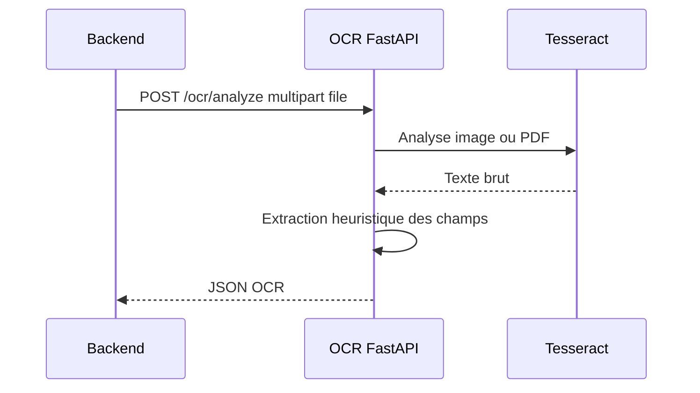

# Service OCR

Le service OCR est une API FastAPI situee dans `ocr/`.

## Role

Le service recoit un fichier facture depuis le backend, extrait le texte avec Tesseract, puis retourne une reponse JSON compatible avec les DTO backend.



## Endpoints

| Methode | Route | Description |
| --- | --- | --- |
| `GET` | `/health` | Healthcheck |
| `POST` | `/ocr/analyze` | Analyse OCR d'un fichier |

## Format De Reponse

```json
{
  "status": "SUCCESS",
  "rawText": "texte extrait",
  "confidenceScore": "0.75",
  "fields": [
    {
      "fieldName": "invoiceNumber",
      "rawValue": "FAC-001",
      "normalizedValue": "FAC-001",
      "confidenceScore": "0.75"
    }
  ]
}
```

Champs actuellement recherches:

- `supplierName`
- `invoiceNumber`
- `invoiceDate`
- `dueDate`
- `totalHt`
- `totalTva`
- `totalTtc`

Les dates de facture et d'echeance sont normalisees au format ISO `YYYY-MM-DD`.
Les formats numeriques francais et americains non ambigus ainsi que les mois en
francais et en anglais sont reconnus. Une date invalide ou numerique ambigue
conserve sa valeur brute, mais sa valeur normalisee reste `null` pour permettre
une verification humaine.

## Tesseract

Les Dockerfiles installent:

```text
tesseract-ocr
tesseract-ocr-eng
tesseract-ocr-fra
poppler-utils
```

`poppler-utils` permet de convertir les PDF en images avant OCR.

## Langues OCR

La variable `OCR_LANGUAGES` controle les langues Tesseract:

```text
OCR_LANGUAGES=fra+eng
```

## Limites MVP

L'extraction des champs est volontairement simple:

- premiere ligne non vide pour le fournisseur;
- regex pour le numero de facture;
- regex et fallback sur le dernier montant trouve pour les totaux.

Pour une version plus robuste, ajouter:

- detection de tables;
- parsing par fournisseur;
- score de confiance reel par champ;
- normalisation plus stricte des dates et montants;
- tests avec un jeu de factures anonymisees.
