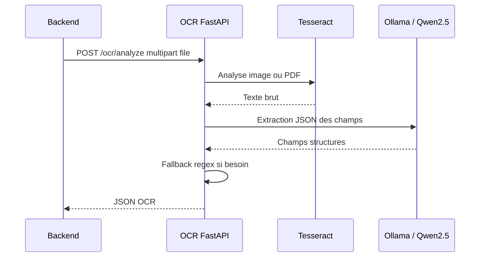

# Service OCR

Le service OCR est une API FastAPI situee dans `ocr/`.

## Role

Le service recoit un fichier facture depuis le backend, extrait le texte avec Tesseract, puis structure les champs avec Ollama/Qwen2.5 quand le LLM est active. Il retourne une reponse JSON compatible avec les DTO backend.



## Endpoints

| Methode | Route | Description |
| --- | --- | --- |
| `GET` | `/health` | Healthcheck |
| `POST` | `/ocr/analyze` | Analyse OCR d'un fichier |

## Format De Reponse

```json
{
  "status": "SUCCESS",
  "rawText": "texte extrait",
  "confidenceScore": "0.75",
  "fields": [
    {
      "fieldName": "invoiceNumber",
      "rawValue": "FAC-001",
      "normalizedValue": "FAC-001",
      "confidenceScore": "0.75"
    }
  ]
}
```

Champs actuellement recherches:

- `supplierName`
- `invoiceNumber`
- `invoiceDate`
- `dueDate`
- `commandReference`
- `totalHt`
- `totalTva`
- `totalTtc`

## Tesseract

Les Dockerfiles installent:

```text
tesseract-ocr
tesseract-ocr-eng
tesseract-ocr-fra
poppler-utils
```

`poppler-utils` permet de convertir les PDF en images avant OCR.

## Langues OCR

La variable `OCR_LANGUAGES` controle les langues Tesseract:

```text
OCR_LANGUAGES=fra+eng
```

## Structuration LLM

Les variables suivantes pilotent l'appel a Ollama:

```text
OCR_LLM_ENABLED=true
OLLAMA_BASE_URL=http://ollama:11434
OLLAMA_MODEL=qwen2.5:7b
OLLAMA_TIMEOUT_SECONDS=45
```

Si Ollama n'est pas disponible ou retourne un JSON invalide, le service garde le fallback regex pour preserver le flux MVP.

## Limites MVP

L'extraction des champs est volontairement simple:

- premiere ligne non vide pour le fournisseur;
- regex pour le numero de facture;
- regex et fallback sur le dernier montant trouve pour les totaux.
- LLM local pour structurer les champs quand il est disponible.

Pour une version plus robuste, ajouter:

- detection de tables;
- parsing par fournisseur;
- score de confiance reel par champ;
- normalisation plus stricte des dates et montants;
- tests avec un jeu de factures anonymisees.
