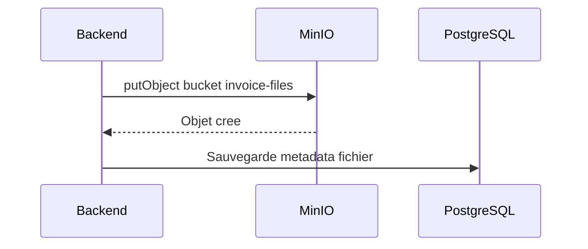

# Stockage Et Base De Donnees

Le projet utilise PostgreSQL pour les donnees relationnelles et MinIO pour les fichiers de factures.

## PostgreSQL

Service Compose:

```text
postgres
```

Image:

```text
postgres:17-alpine
```

Variables principales:

```text
POSTGRES_DB
POSTGRES_USER
POSTGRES_PASSWORD
POSTGRES_PORT
```

Le backend se connecte via:

```text
jdbc:postgresql://postgres:5432/${POSTGRES_DB}
```

## Seed De Donnees

Le fichier PostgreSQL dedie est:

```text
backend/src/main/resources/data-postgres.sql
```

Il initialise les donnees minimales du MVP:

- organisation par defaut;
- roles systeme, permissions atomiques et associations roles-permissions;
- statuts facture;
- utilisateur Owner de demo;
- fournisseur Orange;
- comptes comptables de base;
- regles comptables pour proposer une ecriture depuis une facture OCR.

## Configuration Comptable MVP

Les comptes disponibles sont stockes dans:

```text
chart_of_accounts
```

La configuration qui explique comment transformer une facture extraite en lignes comptables est stockee dans:

```text
accounting_rules
```

Chaque regle indique:

- l'organisation concernee;
- le fournisseur concerne, si la regle est specifique;
- un mot-cle optionnel;
- le compte de charge a utiliser;
- le compte de TVA deductible;
- le compte fournisseur;
- une priorite;
- si la regle est active.

Pour les donnees de demo:

- Orange utilise le compte de charge `626000`;
- les autres fournisseurs utilisent le compte de charge par defaut `607000`;
- la TVA utilise `445660`;
- la dette fournisseur utilise `401000`.

Le backend lit la premiere regle active qui correspond a la facture, puis cree les lignes dans:

```text
accounting_entry_lines
```

La table `accounting_entries` contient l'entete de l'ecriture comptable liee a la facture.

Les inserts utilisent `ON CONFLICT DO NOTHING` pour supporter les redemarrages, puis recalibrent les sequences PostgreSQL.

## MinIO

Service Compose:

```text
minio
```

Image:

```text
minio/minio:latest
```

Le bucket est cree automatiquement par:

```text
minio-init
docker/minio/init-buckets.sh
```

Bucket par defaut:

```text
invoice-files
```

## Flux De Stockage



Format du chemin sauvegarde:

```text
s3://invoice-files/invoices/{invoiceId}/{uuid}-{filename}
```

## Donnees Persistantes

Volumes Docker:

```text
postgres_data
minio_data
```

Supprimer les donnees d'un environnement:

```bash
docker compose --env-file env/.env.dev \
  -f docker-compose.yml \
  -f docker-compose.dev.yml \
  down -v
```

Attention: cette commande supprime les donnees PostgreSQL et les fichiers MinIO.

## Evolution Recommandee

Pour aller vers une production plus robuste:

- remplacer `ddl-auto=update` par des migrations Flyway ou Liquibase;
- externaliser les backups PostgreSQL;
- externaliser MinIO ou utiliser un S3 gere;
- ajouter une politique de retention des fichiers;
- ajouter un endpoint backend pour telecharger les fichiers stockes.
